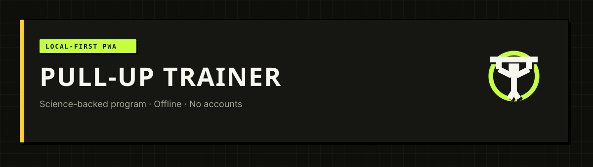
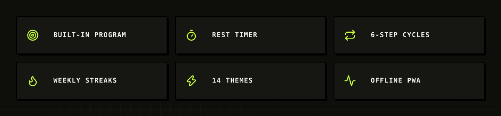
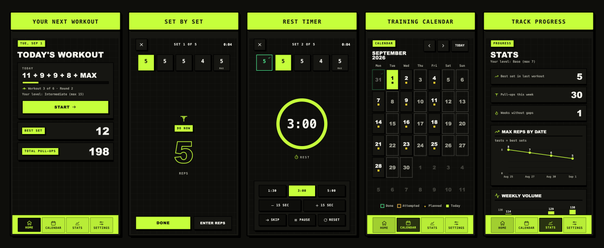

<p align="center">
  
</p>

<p align="center">
  <a href="https://gregorykogan.github.io/pullup-trainer/"></a>
  <a href="https://vuejs.org/"></a>
  <a href="https://www.typescriptlang.org/"></a>
  <a href="https://vite.dev/"></a>
  <a href="https://web.dev/progressive-web-apps/"></a>
</p>

<p align="center">
  <a href="https://vitest.dev/"></a>
  <a href="https://playwright.dev/"></a>
  <a href="https://github.com/GregoryKogan/pullup-trainer/actions/workflows/ci.yml"></a>
  <a href="LICENSE"></a>
  
</p>

<p align="center">
  <strong>Local-first pull-up training PWA.</strong><br>
  One built-in evidence-based program, full offline — no ads, no accounts, no cloud.<br>
  <a href="https://gregorykogan.github.io/pullup-trainer/"><strong>Open live app →</strong></a>
</p>

<p align="center">
  
</p>

## Screenshots

<p align="center">
  
</p>

## About

Pull-up Trainer is a mobile-first progressive web app for structured pull-up training. Everything runs locally in your browser via IndexedDB — your history and progress never leave the device.

The built-in program generates each workout from your max-rep anchor (`M*`) and current step in a 6-workout cycle. Progression, deloads, retests, and scheduling follow rules described on the in-app Why this program page. Install as a PWA for offline use and quick access from your home screen.

## Program at a glance

Each workout has five sets: four working sets at fixed percentages of your anchor `M*`, plus a final max set with a step-specific minimum N<sub>k</sub>.

| M* | Working sets (1–4) | Final-set minimums N₁…N₆ |
|----|--------------------|----------------------------|
| 3  | 3, 2, 2, 2         | 2, 3, 4, 4, 4, 4           |
| 7  | 5, 5, 5, 4         | 5, 6, 7, 8, 8, 8           |
| 15 | 11, 9, 9, 8        | 9, 10, 11, 12, 13, 14      |
| 25 | 18, 15, 15, 13     | 15, 16, 17, 18, 19, 20     |

Default schedule: three non-consecutive days per week with at least 48 hours between sessions. Two failures on the same step trigger an automatic deload; six successful steps complete a cycle.

## Tech stack

- **UI:** Vue 3 (Composition API), Vue Router, Pinia, vue-i18n (EN / RU)
- **Build:** Vite, TypeScript, vite-plugin-pwa
- **Data:** Dexie (IndexedDB), JSON export/import for history and full backup
- **Quality:** Vitest, Vue Test Utils, Playwright, ESLint, Prettier
- **Hosting:** GitHub Pages with CI deploy

## Development

```bash
npm ci
npm run dev          # local dev server
npm run typecheck    # vue-tsc
npm run lint
npm run test         # unit tests
npm run test:e2e     # Playwright (auto-builds preview server)
npm run build
npm run preview      # preview production build
```

## Design system

The app uses **Poster / Swiss** — flat fills, 2px borders, 2px radius, offset shadows, mono caps labels, and display uppercase headings. Default palette: **P01 Volt** (14 palettes × light/dark).

| Resource | Path |
|----------|------|
| Design spec | [`spec/design/poster-design.md`](spec/design/poster-design.md) |
| Theme tokens | [`spec/design/theme-tokens.css`](spec/design/theme-tokens.css) |
| App icon | [`spec/design/assets/logo/icon.svg`](spec/design/assets/logo/icon.svg) |
| Asset gallery | [`spec/design/assets/preview.html`](spec/design/assets/preview.html) |
| Swiss grid pattern | [`spec/design/assets/patterns/swiss-grid.svg`](spec/design/assets/patterns/swiss-grid.svg) |

## License

[GPL-3.0](LICENSE) — Copyright Gregory Koganovsky.

Third-party notice: icons by [Lucide](https://lucide.dev) (ISC). See [`public/NOTICE`](public/NOTICE) and [`spec/design/assets/LICENSES/Lucide-ISC.txt`](spec/design/assets/LICENSES/Lucide-ISC.txt).

<details>
<summary>What this app does NOT include</summary>

- No ads, donations, paywalls, or subscriptions
- No user accounts or cloud sync
- No push reminders (not feasible in a static PWA v1)
- No voice cues, background music, camera, or social features

</details>
